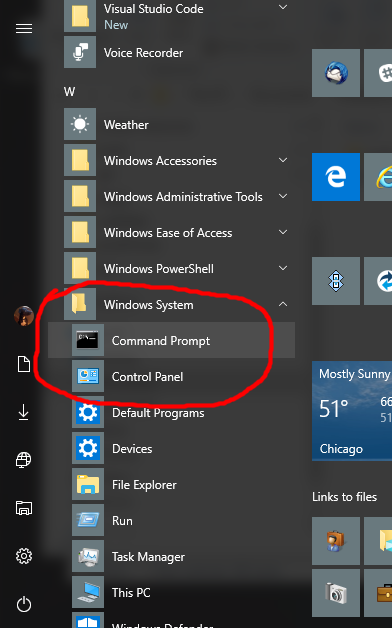
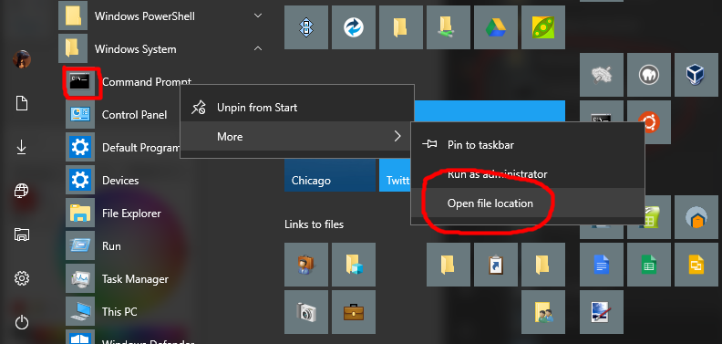
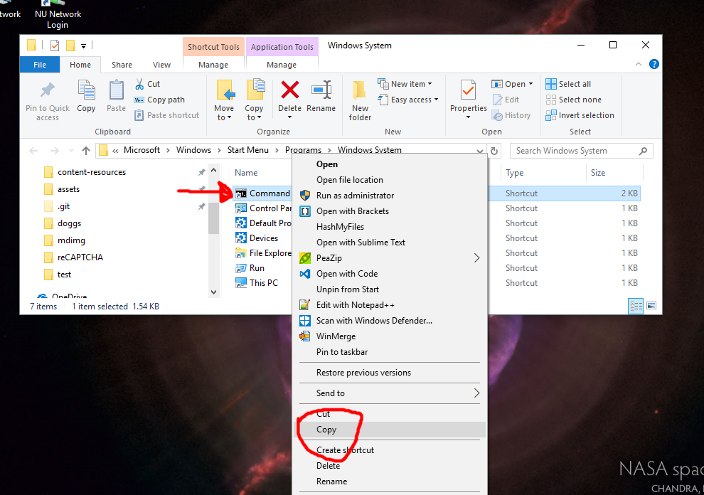
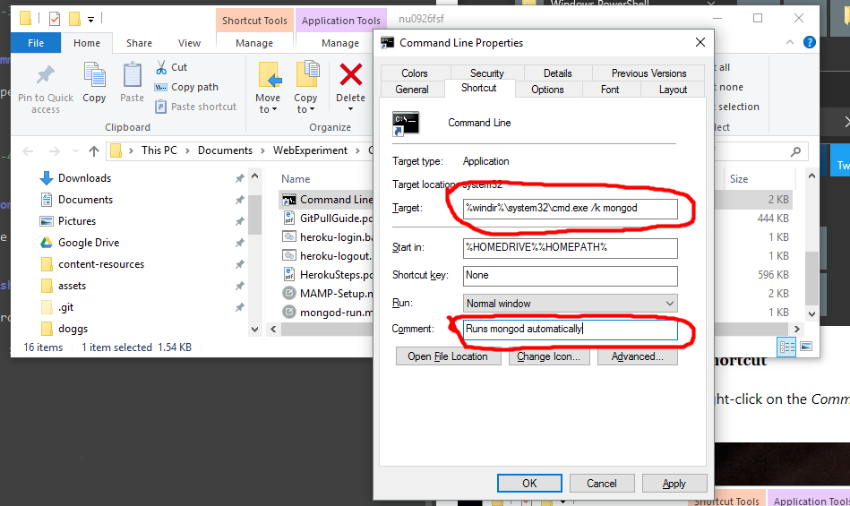
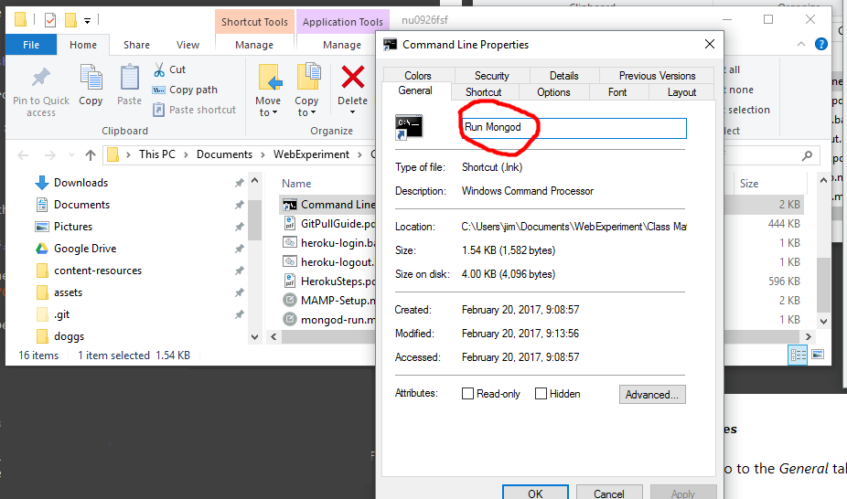
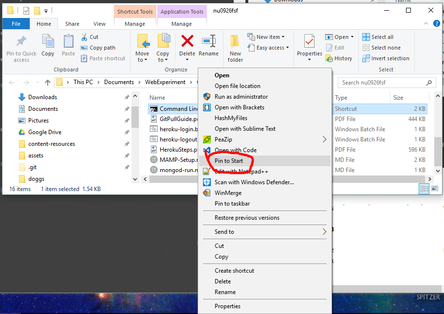
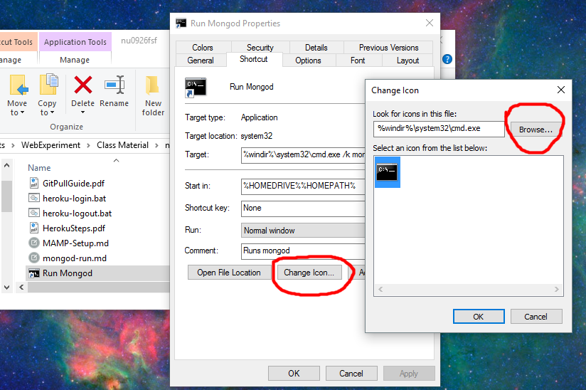
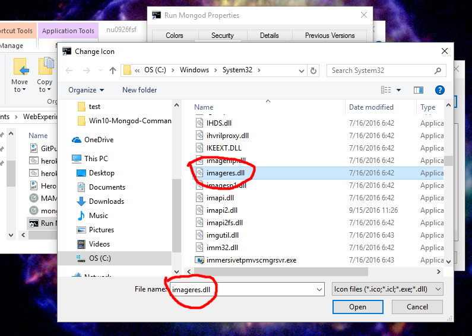
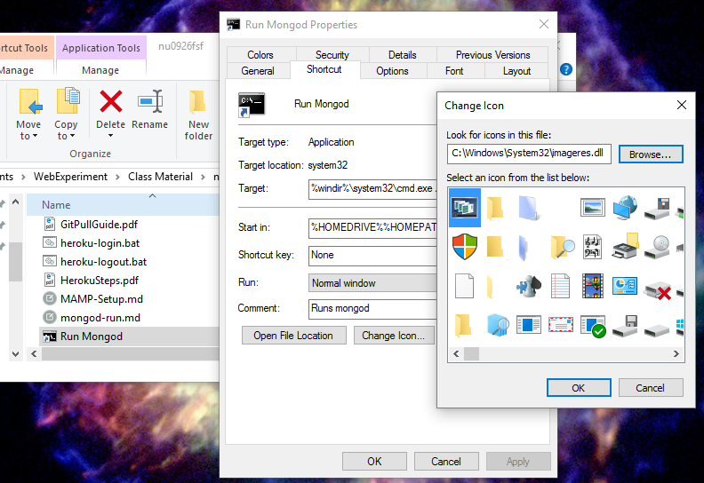

# Run `mondgod` Automatically From a Shortcut (*Windows*)

This file provides instructions for creating a *Windows* command line shortcut that will run `mongod` automatically when it's opened.

## Prerequisites

It is assumed that **MongoDB** has been successfully installed on your PC or laptop. It is also assumed that the reader has some familiarity with using Windows. 

The instructions in this document were created while using *Windows 10*.

## Instructions - Overview

## Instructions - Details

### Step 1 - Create a new folder

Create a folder, it will be used for containing the shortcut that will be created in a subsequent step. For example a folder in your *Documents* folder called *cmd shortcuts* would be sufficient.

### Step 2 - Locate a *Command Line* shortcut

Locate an **existing** shortcut to the Windows command line. In *most* Windows 10 installations a command line shortcut is located in the *Start Menu* under the *Windows System* menu - 

### Step 3 - Open shortcut file location

Right-click on the *Command Prompt* and hover over *More* and then click "*Open file location*".

### Step 4 - Copy the command line shortcut

An explorer window has opened, now right-click on the *Command Prompt* icon and choose *Copy*.

### Step 5 - Paste the command line shortcut

Using *Explorer* navigate to the folder that you created in *Step 1* and paste the shortcut there.

### Step 6 - Modify the shortcut properties

The following shortcut properties will be modified in this step - 

Under the *Shortcut* tab :
* Target
* Comment

Under the *General* tab :
* The text input box at the top contains the shortcut *name*.

#### Step 6A - Properties, Shortcut tab changes

Change the contents of the *Target* field to contain `%windir%\system32\cmd.exe /k mongod`. And change the *Comment* field to - `Runs mongod automatically`.

**Note :** Leave the properties dialog open for the next step.

#### Step 6B - Properties, General tab changes

With the properities dialog *still opened* go to the *General* tab and modify the field at the top near the icon to read 'Run mongod`.

#### Step 6C - Save the shortcut changes

Now click the *OK* button and your changes to the shortcut will be saved. 

### Step 7 - *Optional* : Pin to start menu

If you want to have access to the shortcut through a *tile* on your start menu right-click on your *Run mongod* short cut and choose *Pin to Start*. Then go to your start menu tiles and move or resize the new tile as needed.

### Step 8 - *Optional* : Change the Icon

You can optionally change the icon. Changing it might make it easier to recognize in your start menu.

Right-click on your new *Run mongod* shortcut and choose *Properties*. Then go to the *General* tab and click the *Change Icon...* button.

A new dialog will come up showing only 1 icon. To get a better selection of icons click the *Browse...* button and choose the `imageres.dll` file and click *Open*.

Now you have a wide range of icons to choose from, select one and then cick *Ok* and then click *Ok* on the shortcut properties dialog.

## Done!

You should now have a shortcut that will run `mongod` automatically for you. To stop `mongod` and close the window just click the *X* in the upper right corner of the mongod command line window.
